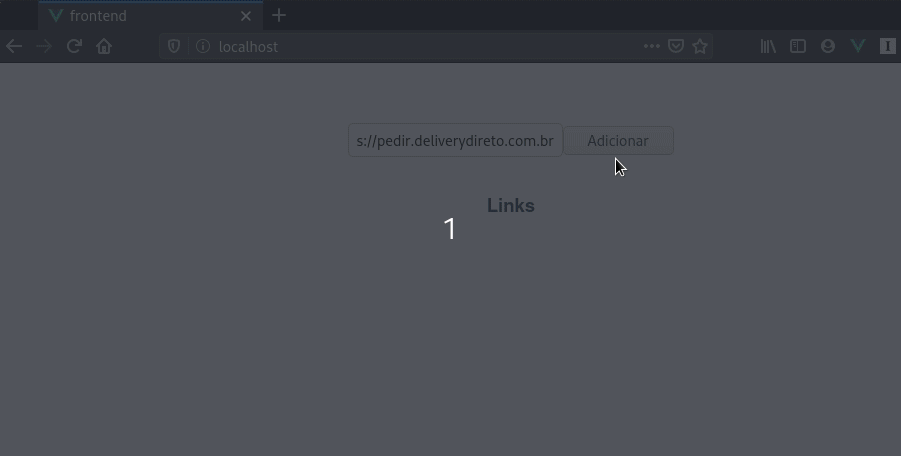

# DevOps Case Study

Este é um projeto bem simples, mas que serve pra
ilustrar vários sistemas funcionando em conjunto.

Existem 3 aplicações. A `backend`
é uma API Rest bem simples, utilizando [Lumen PHP](https://lumen.laravel.com/). A API tem poucos endpoints, e servem para retonar e salvar `links`.

O `frontend` é uma aplicação utilizando
[Vue.js](). É em javascript, utiliza a API do `backend`, e tem apenas uma página (o `/` mesmo)

O `worker` é um _python script_ que  consome eventos do [Redis](https://redis.io/), e após processar, faz uma nova chamada pra API do `backend`.

E para tudo funcionar, também depende de um
banco de dados [MySQL](https://www.mysql.com/) e do _Redis_, utilizado para [pubsub](https://redis.io/topics/pubsub).

## Objetivo

Rodar todas as aplicações em conjunto, configurando os serviços através do [docker-compose](https://docs.docker.com/compose/), isso significa que na raiz do projeto, deve existir um arquivo `docker-compose.yml`, e que ao rodar o comando:

```
$ docker-compose up
```

Podemos acessar http://localhost e ver o sistema funcionando sem problemas, adicionando novos links.

Como você irá resolver é aberto, pode usar um ou
mais `Dockerfiles` pra configuração, pode utilizar imagens já prontas, ou criar as suas (desde que estejam públicas).

Como já dito, o objetivo é que o sistema rode sem problemas, igual ao exemplo abaixo:




## Como começar

Faça um _fork_ ou clone esse projeto. Ele tem apenas as aplicações, você deve adicionar o `docker-compose.yml`, e `Dockerfiles` se achar necessário. No `docker-compose.yml`, devem existir 5 _services_:

- `backend` o serviço que roda a API, que deve usar PHP 7.4
- `frontend` que roda o front como um ambiente de produção, usando [Nginx](https://nginx.org/)
- `worker` roda o `subscriber.py` como se fosse um _daemon_. Deve usar Python 3 (3.8 de preferência)
- `db` roda o banco de dados MySQL (5.7 de preferência)
- `redis` roda um Redis 4

Como comentei, você pode criar `Dockerfiles` onde achar necessário, recomendo deixá-los dentro da pasta da respectiva aplicação. Por exemplo, se fizer um `Dockerfile` pra usar com o _service_ `backend`, crie o arquivo `backend/Dockerfile`.

### Dicas e sugestões

- Em teoria, a única coisa que você precisa fazer é criar o `docker-compose.yml` e `Dockerfiles`. Todo o código já está pronto pra funcionar, desde que você use os nomes de serviços que foram pedidos. Não deveria ser necessário editar nenhum dos arquivos existentes (é claro que você pode editar, mas saiba que não é uma pegadinha, tudo funciona)
- Dentro da pasta `frontend`, já existe um arquivo de configuração pro Nginx, o `default.conf` que você pode usar sem alterações. Nesse arquivo, também dá pra descobrir qual a porta que o [FPM](https://php-fpm.org/) precisa rodar no serviço do `backend`. Também dá pra saber qual diretório usar como `root` no `frontend` e `backend`.
- Todas as portas dos serviços podem ser mantidas como padrão, em nenhum lugar é usado uma porta diferente do esperado.
- Ao rodar o _python script_ em um serviço, tem a opção `-u` (_unbuffered_). Se rodar sem essa opção, `print`'s podem não aparecer nos logs.
- Existe a pasta `data/db` e `data/redis`, que recomendo usar de volumes para os respectivos serviços.
- Ao rodar pela primeira vez, é preciso rodar uma migração para criar o _schema_. No caso do Lumen, é só usar o seguinte comando no container do `backend`:
```
$ php artisan migrate
```
- Para rodar o `backend`, além de usar o PHP 7.4, será necessário ter algumas extensões instaladas, são `mysqli`, `pdo_mysql` e `redis`. Também será necessário ter o [Composer](https://getcomposer.org/), e instalar as dependências do projeto com o comando abaixo:
```
$ composer install
```
- No `backend`, as variáveis de ambiente que 
configuram a aplicação, estão presentes no
arquivo `backend/.env`
- Para rodar o `frontend`, você pode gerar o projeto pra deploy em produção com o comando abaixo. O projeto será gerado em `dist`. Antes, precisa ter instalado as dependências usando o próprio [NPM](https://www.npmjs.com/).
```
$ npm install
$ npm run build
```
- Para rodar o `worker`, precisa instalar as dependências que estão no arquivo `requirements.txt`, pode-se usar o [pip](https://pip.pypa.io/en/stable/)
```
$ pip install -r requirements.txt
```
- O `db` precisa estar configurado com a database `example`, com usuário `example` e senha `example`. Se for usar outros valores, precisará editar o `.env`.

### Bônus
Além de rodar o projeto em http://localhost, você pode configurar o acesso por TLS em https://localhost (na porta 443 mesmo).

Não é necessário utilizar um certificado válido, verificado por uma _Certificate Authority_. Basta utilizar um _self signed certificate_ gerado por [OpenSSL](https://www.openssl.org/) ou similar.

### Perguntas
Estas perguntas não precisam ser respondidas dentro do projeto, é apenas para conversarmos durante a discussão, quando
for apresentar a sua solução.
- Você entendeu como funciona a estrutura geral? Consegue descrever o que acontece
no momento em que você adiciona um link e clica no botão de adicionar?
- Teve algo novo que você aprendeu neste projeto? O que foi que você acho
mais difícil?
- Quais sugestões e melhorias você teria para o projeto? Existe algum problema
mais sério que você encontrou?
